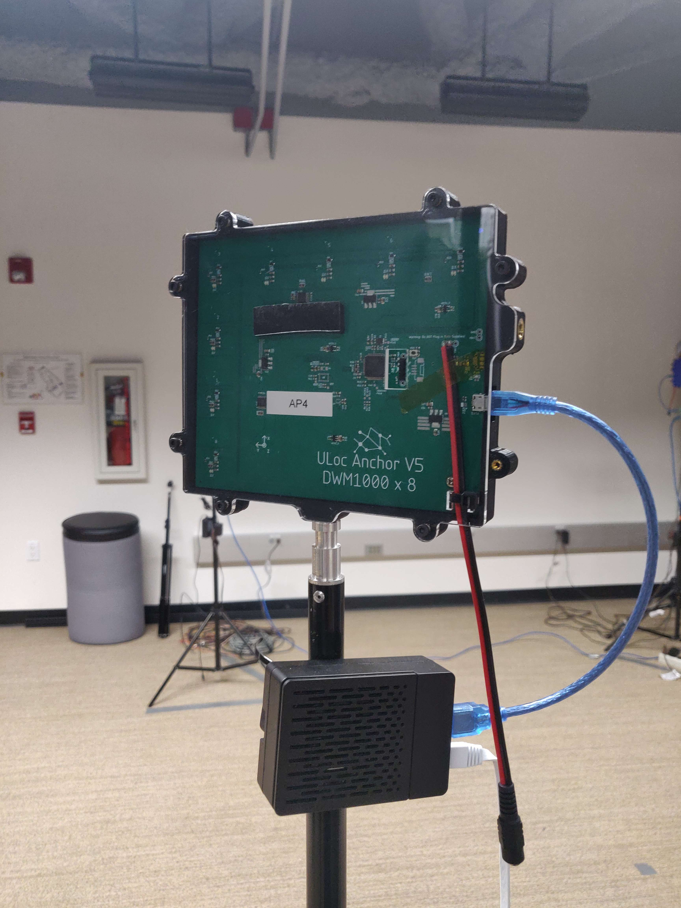
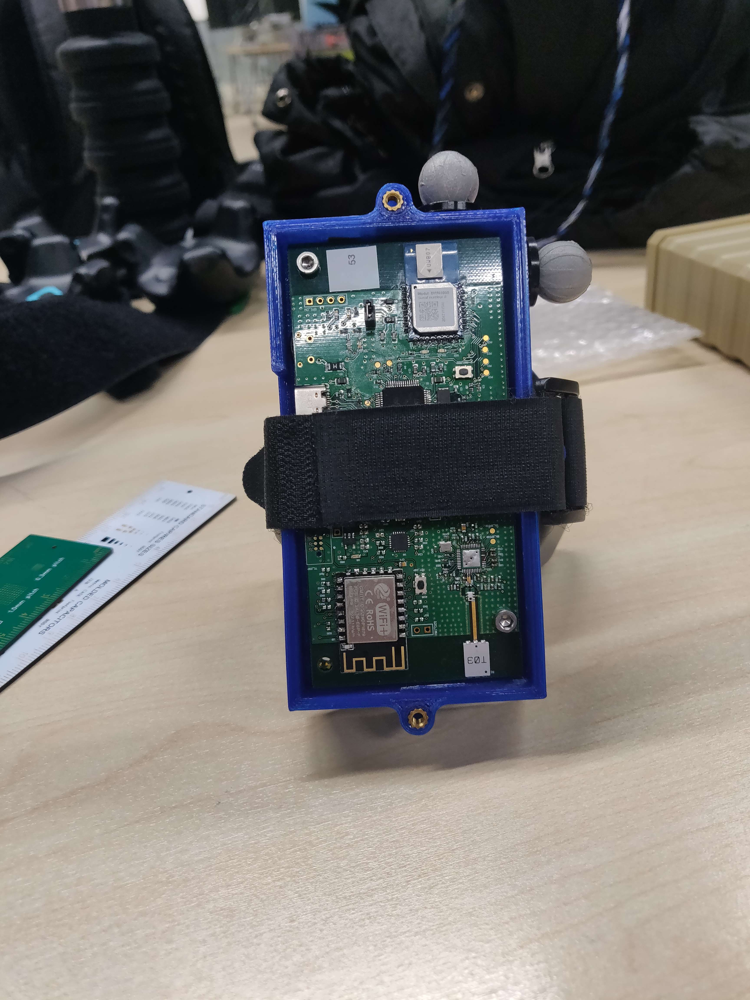
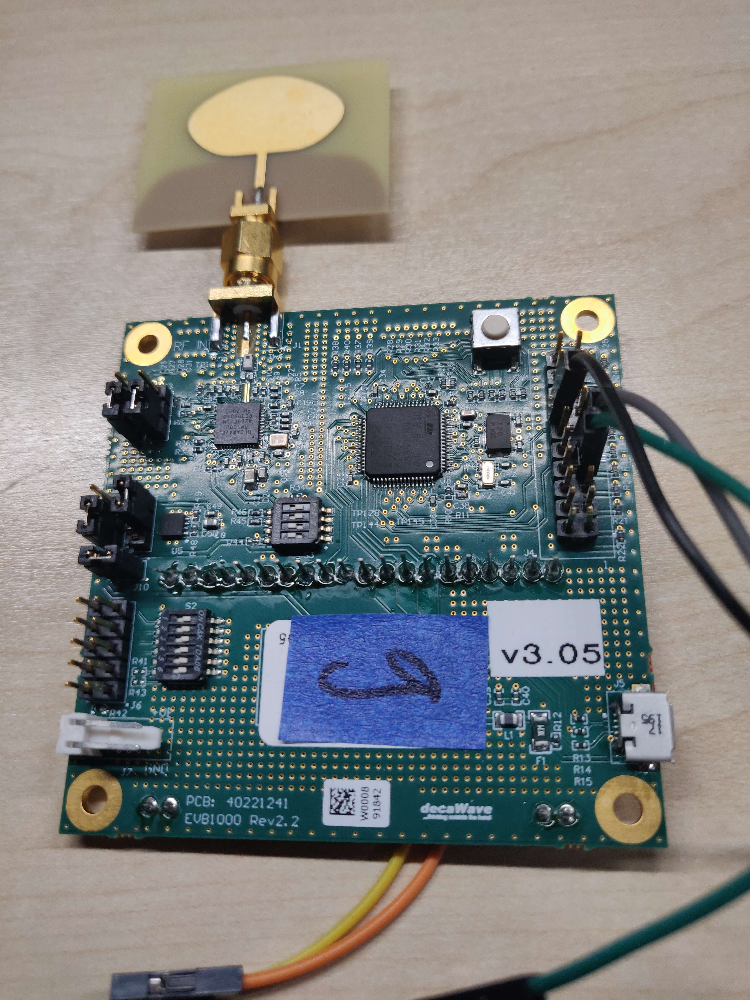
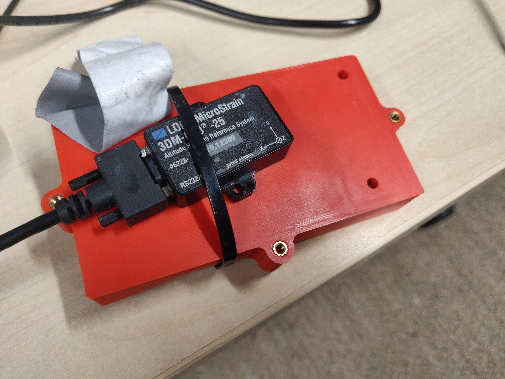
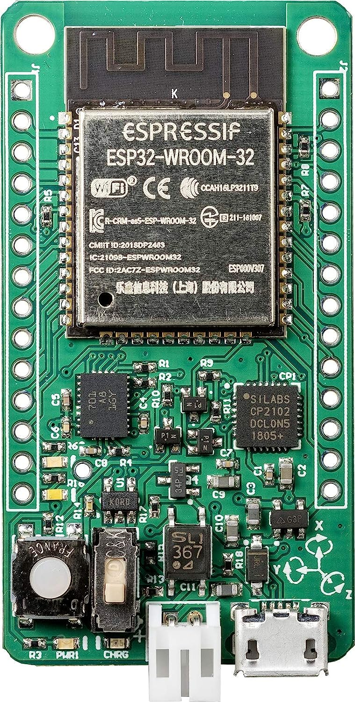

# Full-body tracking

## Overview

Full body tracking systems have many use cases such as virtual reality and rigging for CGI video productions. There are several existing techniques that deal with tracking; however current methods have severe limitations which we aim to address.

The first and most common body tracking method is visual tracking where the users wear several reflective markers on the body that is seen by an external capture device such as a camera. This capture device is able to then take the location of where each marker is and calculate the body location. Despite this being a commonly used method, there are major limitations including a steep initial setup cost, time, and labor as well as a limited capture space. This is compounded by occlusion, or broken line of sight between the capture device and person which creates the need for even more capture devices.

The second method is using several very accurate inertial measurement units (IMU) and estimating body movement. This has advantages over visual tracking where the user does not have to consider the location of capture devices. However, its core disadvantage is the accumulation of error over time. In order to attain the position of the body, an integration needs to be done relative to acceleration which causes positional drift to occur after around 5 to 10 minutes. Some companies have used high-precision IMUs to address this issue but such devices are expensive and still prone to error after enough time.

Our project plan is to improve on both solutions by using ultra-wide band (UWB) trackers. Moreover, we plan to use ultra-wide band emitters and receivers to create a closed loop system - that is, a system that uses multiple sources of data to implement robust error correction - minimizing the IMU error build up and greatly extending the possible capture time. This will also allow a user to operate in any space without the need for prior set up and any associated costs.

## Foreword

For this project to happen, we are grateful to collaborate with UCSD's research group, Wireless Comunications, Systems and Networking (WCSNG), and to have the opportunity to work with their UWB system called ULoc. In addition, our implementation of full body tracking uses PE-DLS from the work of Zeng, Q., Zheng, G. and Liu, Q. in which said code was generously provided in their code repository.

## Technical details

The mechanics of our implementation in using UWB and IMU data is through the triangulation of UWB distance vectors and using sensor fusion between this and the IMU data. Both of these metrics are outputted from the tag, a PCB board that contains an MPU6050 and a Decawave module. UWB and IMU data are handled in separate pipelines that eventually leads to the host computer, which aggregates the data.

For UWB data, the tag's Decawave module emits a UWB pulse at a set interval. The UWB access points, which contain an array of Decawave receiver modules in the horizontal and vertical direction, can use phase differece to determine a distance vector. Each of the four access points sends the data from the receivers to their own Raspberry Pis that calculates this vector and then sends it to the host computer. The host computer then uses the distance vectors from each of the four access points to triangulate the tag's position given the known distances between each access point.

As opposed to the complex nature of gathering UWB data, collecting IMU data from the tag is much simpler. With the ESP32 on the tag, the rotation and acceleration of the MPU6050 IMU is sent directly to the host through a UDP socket. 

At the moment, 3 tags are used to locate the position of the lower body which is process by the PE-DLS implementation to find the body pose. We are currently facing challenges in sensor fusion where we need to account for three different cases:
* Synchronization - Each of the three tags need to send data to the host at the same time in order to better associate the UWB and IMU data to each other.
* IMU Calibration - The MPU6050 is well known for its drift and bias. We need to calibrate the IMU to account for this by using a high precision IMU as a reference.
* Sensor Fusion - We need to fuse the UWB and IMU data together to improve the accuracy of both.

## Equipment details

The equipment needed for this project are as follows:

- UWB access point: There are four of these UWB access points which stand in one corner of the room. The UWB access points will listen to the UWB emitted from the tag and send it to their own Raspberry Pi.
- Raspberry Pi (3 or above preferred): There are four Pis that are each attached to their own access point. The Raspberry Pi handles the data collected from the UWB access point and calculates the location of the tag from the phase difference. Additionally, it transmits the calculated distance vector of a tag via Ethernet cable back to the host server.

  

- Tag (also called tracker): These are devices that are attached to the body to track the user's pose. Each has an MPU6050 IMU inside that is capable of measuring the rotation and acceleration of the body part it attaches to. These data are then transmitted via Wifi back to the server. The tag is also responsible for sending out UWB emissions to the UWB access points.

  

- Alternative UWB emitter: These are alternative devices meant to emit only UWB waves very reliably. This is mainly due to the better antenna that is tailored for broadcasting UWB waves. We used this to compare against the actual tag, which does not have this antenna, to gauge for accuracy.

  

- High precision IMU: This is an expensive but highly accurate IMU. We attached this to the back of a tag and compared the data between the tag's MPU6050 IMU and this one. The reason for this setup is to derive the covariance of their measurements to define the noise that is present in the tag's IMU. This is needed for the sensor fusion between IMU and UWB to get more accurate data points.

  

- ComplexArts Sensor Board: These boards contain a BNO085, which are typically regarded as cost effective IMUs. With these boards, we compared our implementation against SlimeVR as the ground truth.
  
  

- Host Server: A general desktop computer that listens to all data from the Raspberry Pi and tags regarding UWB and IMU data.

## Team Contributions

Everyone:

- Set-up the ULoc system environment for use in the project
- Evaluated current hardware used
- Examined current codebase for allowing UWB tracking
- Gathered visual and quantitative data on UWB positions
- Researched into comparable implementations of pose estimation

Anh Le:

- Implemented IMU tag time syncing - (margins of less than 500 microseconds between any tag)
- Set up the UWB to gather data in tandem with data pulled from IMUs

Branson Beihl:

- Characterized positional errors on the UWB system
- Collected test data for the IMU characterization
- Fine tuned the IMUs' data using data from the accurate IMU

Danny Vo:

- Set up ground truth comparison and gathered positional data using Vive VR Trackers
- Modified PE-DLS IK solver to use for transforming expected factor graph data from UWB and IMU telemetry into a pose

Michael Shao:

- Designed the IMU synchronization system
- Characterized the error on the IMU system
- Generated factor graph to sensor fuse the IMU & UWB positional data

## Repository organization

The codes for this project are separated into multiple small repositories. Please request access using the form in the following link if you are interested: [WCSNG @ UC San Diego](https://wcsng.ucsd.edu/)

- [ULoc_Data_Collect_Sync](https://github.com/ucsdwcsng/ULoc_Data_Collect_Sync): This repositoriesitory is the code to run the server. It starts the server, listens to the data from the four Raspberry Pi's and the tag, and then outputs into a log file the Cartesian location of the tag and IMU data.
- [ULoc_ESP_UDP](https://github.com/ucsdwcsng/ULoc_ESP_UDP): This repository is the code that runs on the tag. It is responsible for wifi communications and broadcasting UWB data.
- [uloc_firmware](https://github.com/ucsdwcsng/uloc_firmware): This repository contains code that runs the firmware on the access points.
- [data_collection_template](https://github.com/ucsdwcsng/data_collection_template): Contains the code that runs on the four Raspberry Pi's.
- [uloc_post_processing](https://github.com/ucsdwcsng/uloc_post_processing): Contains some algorithms and code to process the UWB data for use in other repositories.
- [ULoc-IMU_Fusion](https://github.com/ucsdwcsng/ULoc-IMU_Fusion): Contains algorithm to turn ULoc and IMU fused data into a pose in the form of a skeleton using PE-DLS.

## Works Cited
Minghui Zhao, Tyler Chang, Aditya Arun, Roshan Ayyalasomayajula, Chi Zhang, and Dinesh Bharadia. 2021. ULoc: Low-Power, Scalable and cm-Accurate UWB-Tag Localization and Tracking for Indoor Applications. Proc. ACM Interact. Mob. Wearable Ubiquitous Technol. 5, 3, Article 140 (Sept 2021), 31 pages. https://doi.org/10.1145/3478124

Zeng, Q., Zheng, G. & Liu, Q. PE-DLS: a novel method for performing real-time full-body motion reconstruction in VR based on Vive trackers. Virtual Reality 26, 1391–1407 (2022). https://doi.org/10.1007/s10055-022-00635-5
